# PlatformIo.TCapChamp

## Description
`ESP32` project that manipulates the outside temperature measurement to adjust the heat pump cycle rate. In case the heat pump is overdimensioned it can increase its efficiency dramatically since you can adjust the cycle rate specifically on your environment and needs.
The manipulated temperature output needs to be connected to the external temperature sensor of the T-Cap.

If you already use an external temperature sensor you can connect it as input sensor for the ESP, in case you don't have a temperature sensor you can use the free [OpenWeather API](https://api.openweathermap.org) to receive actual temperatures. 

Via an optional 0-10V DAC it is also possible to limit the power consumption via `Demand Control` of the T-Cap.

> [!NOTE]
> You can find the measurements, charts and calculations inside the [TestsAndCharts.xlsx](Documentation/TestsAndCharts.xlsx),
> device specific information can be taken from the [T-Cap Service Manual (PDF)](https://www.kaelte-bast.de/dateien_neu13/Panasonic/01-produktunterlagen/aquarea/produkte/waermepumpen/t-cap/sqc/handbuch_englisch/sm_wh-sqc09h3e8%2Cwh-sqc12.16h9e8_%28papamy1704053ce%29.pdf)

> [!TIP]
> Most important Manual pages:
> - 49 Wiring Connection Diagram
> - 53 Electronic Circuit Diagram
> - 56 Main Circuit Board 
> - 57 Sub Printed Circuit Board
> - 76 Cable management
> - 78 Temperaute Sensor
> - 88 Demand Control
> - 128 Alternative Outdoor Ambient Sensor Control

> [!Caution]
> The connection between the T-Cap and the Controller should only be done by a trained professional. 
> **There is a danger to life due to high voltage (230V/400V) within the device!**

## Features
| Feature                                              | Completed |
| ---------------------------------------------------- | --------- |
| Automatic switch between WiFi AP and Client mode     | &#10003;  |
| Hardware sensor for input temperature                | &#10003;  |
| Weather API for input temperature (OpenWeather)      | &#10003;  |
| 0V-10V Demand control (Requires optional board)      | &#10003;  |
| OTA Updates                                          | &#10003;  |
| Captive Portal (if not working use IP `192.168.4.1`) | &#10003;  |
| Custom webinterface for better accessibility         | &#10007;  |

## Bill of Material & Tools
| Name                                                       | Required | Description                                                                   |
| ---------------------------------------------------------- | -------- | ----------------------------------------------------------------------------- |
| [ESP32 NodeMCU-32S](https://www.amazon.de/dp/B0CQSWC67G)   | &#10003; | Microcontroller                                                               |
| [MCP4151-503E/P](https://agelektronik.de/digital-potentiometer/6459-mcp4151-503ep-digital-potentiometer50k256-steps1-kanalspidip-8.html)   | &#10003; | Digital Potentiometer 50K, 256 steps, SPI   |
| [Electrical wire 0.5mm² 20awg](https://www.amazon.de/dp/B08BZKR22W) | &#10003; | For bridges on custom Controller board                               |
| [Electrical wire 18awg 2×0.75mm²](https://www.amazon.de/dp/B0B7WSMR8L) | &#10007; | Connection optional 0-10V Demand Control to T-Cap                 |
| [Electrical wire 18awg 4×0.75mm²](https://www.amazon.de/dp/B0BFWL2RZB) | &#10003; | Connection temperature output to T-Cap                            |
| [Prototype Board](https://www.amazon.de/dp/B08F2TS7ZC)     | &#10003; | For final board                                                               |
| 10k resistor                                               | &#10003; | Voltage devider for input sensor                                              |
| 5k resistor                                                | &#10003; | Pre-Resistor for Digital potentiometer (defines the possible output temperature, in my case +30°C to -20°C) |
| 2k resistor                                                | &#10003; | GND pulldown for unused Digital potentiometer terminal                        |
| [4CH 5V Relay Module](https://www.amazon.de/dp/B09FS5G1Y9)| &#10007; | Optional relay module (High-Level-Trigger) for fallback implementation, not required but highly recommended!  |
| [DFRobot Gravity I2C DAC Module](https://www.dfrobot.com/product-2613.html) | &#10007; | Optional I2C DAC 0-10V for Demand Control                    |
| [Breadboard Kit](https://www.amazon.de/dp/B0B18G3V5T)      | &#10007; | Prototype Board for testing                                                   |
| [Connectors](https://www.amazon.de/dp/B087RN8FDZ)          | &#10007; | Connector for wires                                                           |
| [Socket for ESP](https://www.amazon.de/dp/B07DBY753C)      | &#10007; | Socket for ESP                                                                |
| [IC Sockets](https://www.amazon.de/dp/B01GOLSUAU)          | &#10007; | IC Socket for MCP4151                                                         |

### Tools
- Soldering iron, Solder...
- Multimeter

## Electrical Drawings
You can find the the electrical drawings and parts inside `Documentation\Fritzing` as [Fritzing](https://fritzing.org/) (freeware) project.

## Final board (example)
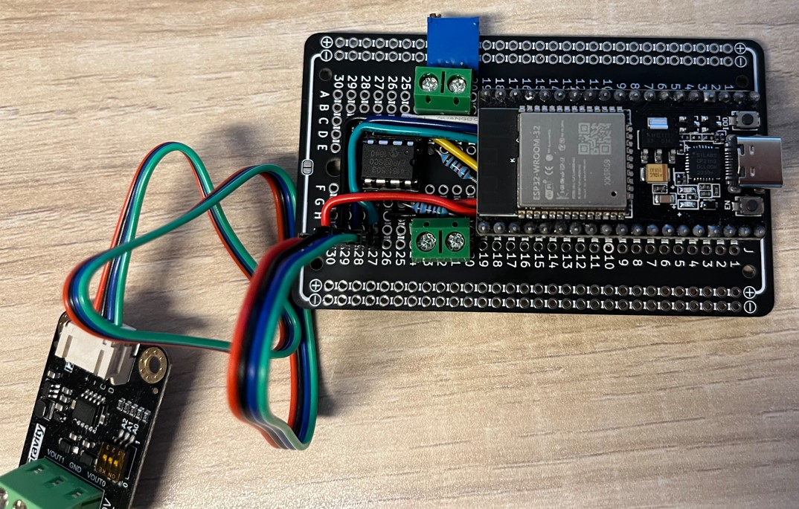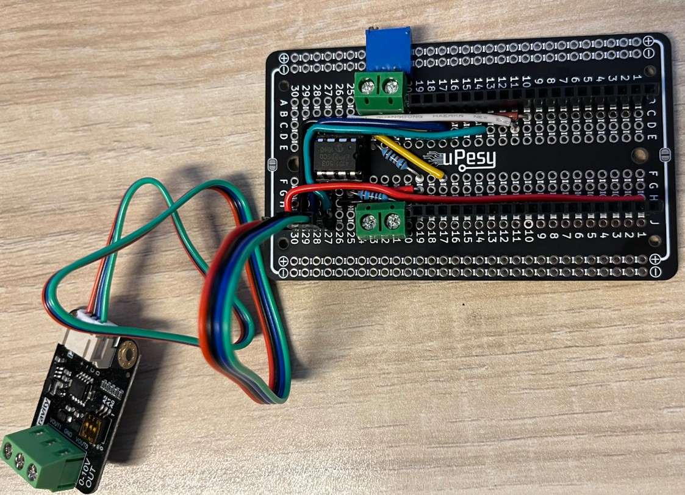

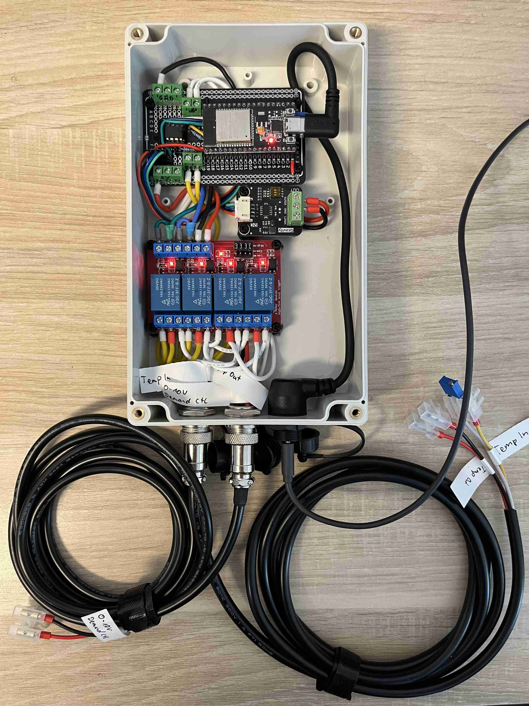

## Webinterface
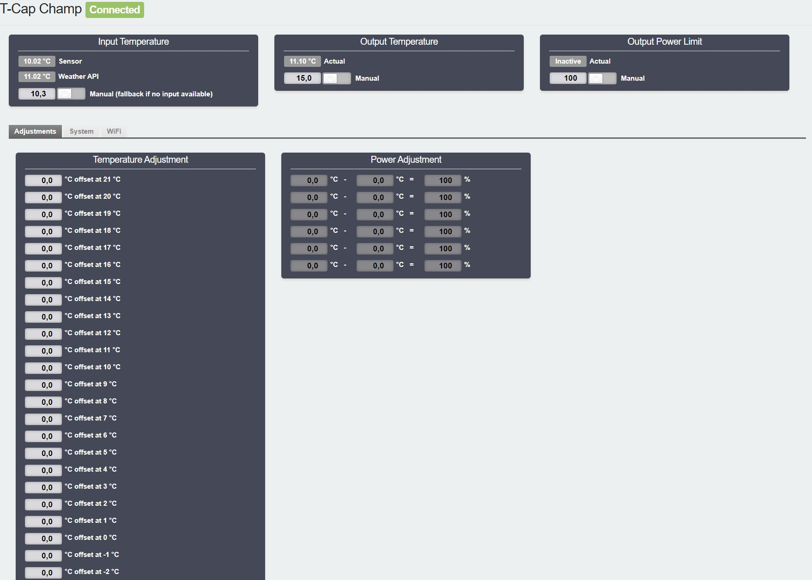

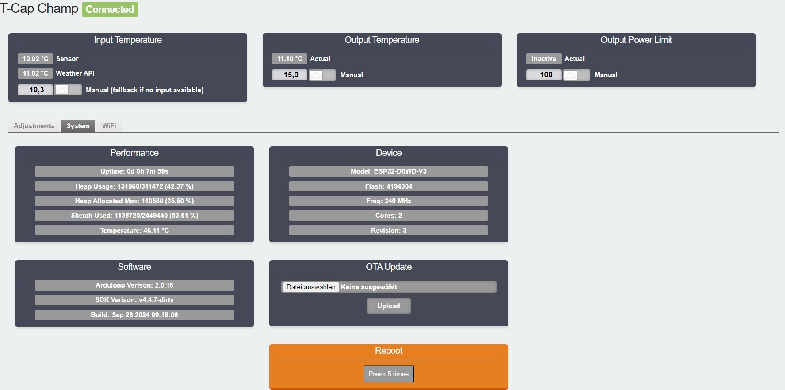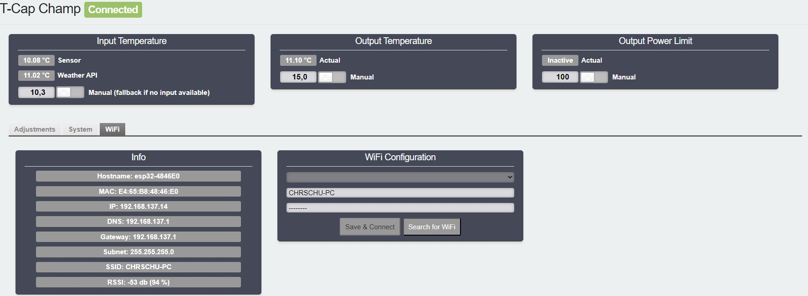

## Building the Project
For privacy reasons some settings are defined inside a header file that is excluded from git.
Since this information are used inside the classes copy and rename the file `Secrets.template.h` to `Secrets.h` to resolve build errors after cloning.

## Weather API
If there is no input sensor available you can use the integrated [OpenWeather API](https://openweathermap.org/current).
To do so you need to create a [free account](https://home.openweathermap.org/users/sign_up) to receive the required `API Key`.

The city ID can be taken from [OpenWeather](https://openweathermap.org) by searching for the location and can than be taken from URL `.../city/**xxxxxxx**`.
As alternative you can also use the `Latitude` + `Longitude` that can be taken from [Google Maps](https://www.google.com/maps) by right-click menu

> [!NOTE]
> Requests for free accounts are limited to to 60 calls/minute or 1,000,000 calls/month

## Temperature Adjustment

### The cheap solution
A common way to manipulate the temperature is to connect a parallel resistor (e.g. 75kΩ) to the external sensor. The problem with this approach is that a thermal resistor isn't linear and because of that the temperature offset increases as the real temperature goes down:

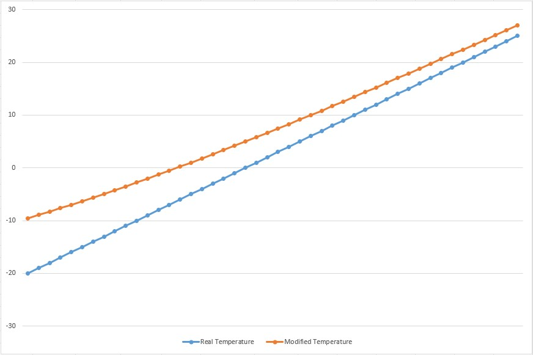

### The superior solution

### Temperature Adjustment
Due to the precision problems with a parallel resistor this project has been started, to provide a more granular and comfortable way, without changing hardware if another offset is required. 

It also makes it a lot easier at the beginning, since first you need to figure out what offset is the best based on your environment and preferences. To do so you can control input and output temperatures manually until you know where your sweetspot is. Afterwards the controller manipulates the output temperature based on a input temperature fully automated.

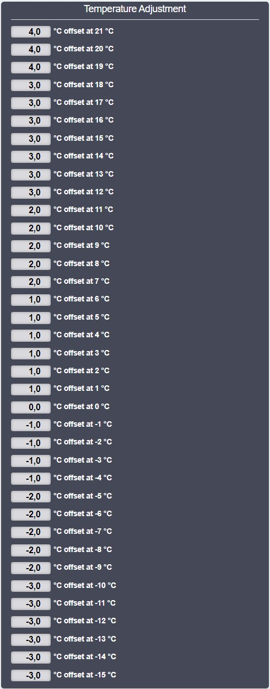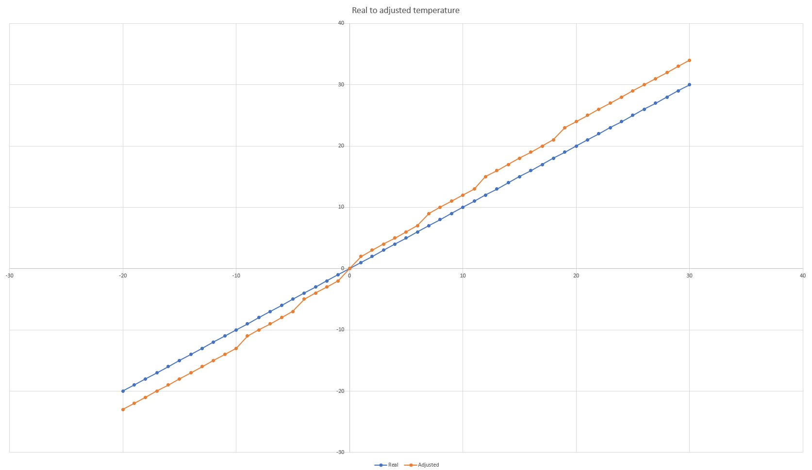

### Input Temperature
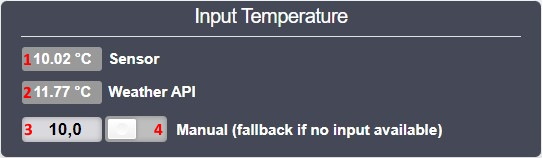

1. Temperature from hardware sensor (`nan` if not connected)
2. Temperature received from the Weather API (`nan` if not configured)
3. Manual temperature input for testing (if `1` and `2` are `nan` value is used as fallback)
4. Force manual temperature `3` on/off

### Output Temperature

1. Actual output temperature (closest available to `2`, limited by the steps of the `Digital Potentiometer`)
2. Target temperature (input temperature + offset)
3. Manual output temperature for testing (ignores adjustment offsets)
4. Force manual output temperature `3` on/off

> [!IMPORTANT]
> Keep in mind that the components are not perfect and have tolerances. Also the `Digital Potentiometer`
> works with limited steps, which can't alway be on spot. 
> The `Target Temperature` is calculated and may not match the `Output Temperature` that represens the
> mathematically closest available resistance. If you want, you can use the T-Cap sensor calibration for compensation.
>
> Below you can find a chart with the delta between `Target Temperature`, `Output Temperature`
> and the measured output temperature that the T-Cap will read from the physical output resistance:
> 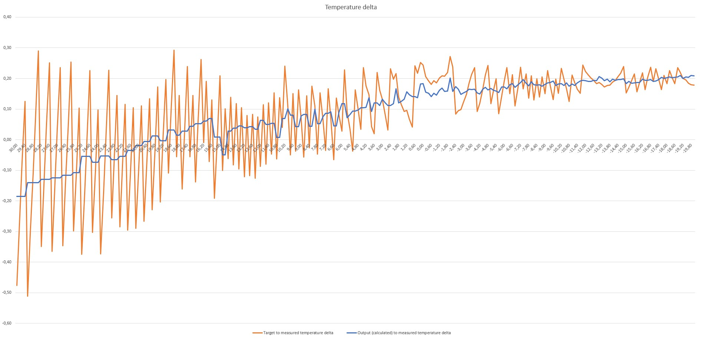

## Demand Control (optional)
The T-Cap provides a 0-10V analog input to limit the power consumption. It can be a handy tool to optimize the heat pump even more as what is possible only by temperature adjustments.

To do so you can define temperature areas and its power limit inside the UI.

> [!NOTE]
> The `Input Temperature` will be used to determine the area, this ensures that 
> temperature adjustments will not influence the power limits.

> [!TIP]
> The first matching area will be uses (top to buttom). In case no responsable area will be found the output will be set to 0V (not active).
> If you like to define a default limit place the value inside the last area with start 30°C and end -20°C and define specific areas above. 
> To deactivate areas set start and end temperature to the same value.

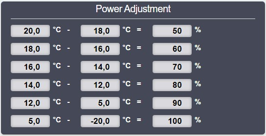

### Output Power Limit

1. Actual power limit send to the T-Cap
2. Manual output power limit for testing (ignores adjustments)
3. Force manual output power limit `2` on/off

> [!NOTE]
> Power limit can be defined in a range between `10%-100%` in `5%` steps.
> Values `<10%` are handled as `not active`

## Wiring T-Cap

> [!Caution]
> The connection between the T-Cap and the Controller should only be done by a trained professional. 
> **There is a danger to life due to high voltage (230V/400V) within the device!**

> [!IMPORTANT]
> Please check the manual carefully to your specific device, this instruction is based on the `WH-SQC16H9E8`!
> In case you have another unit you might need to use other connectors within the device!

For all connection to the T-Cap I've used `0.75mm²`, you can also use another cable but **you need to use at least `0.3mm²`!**

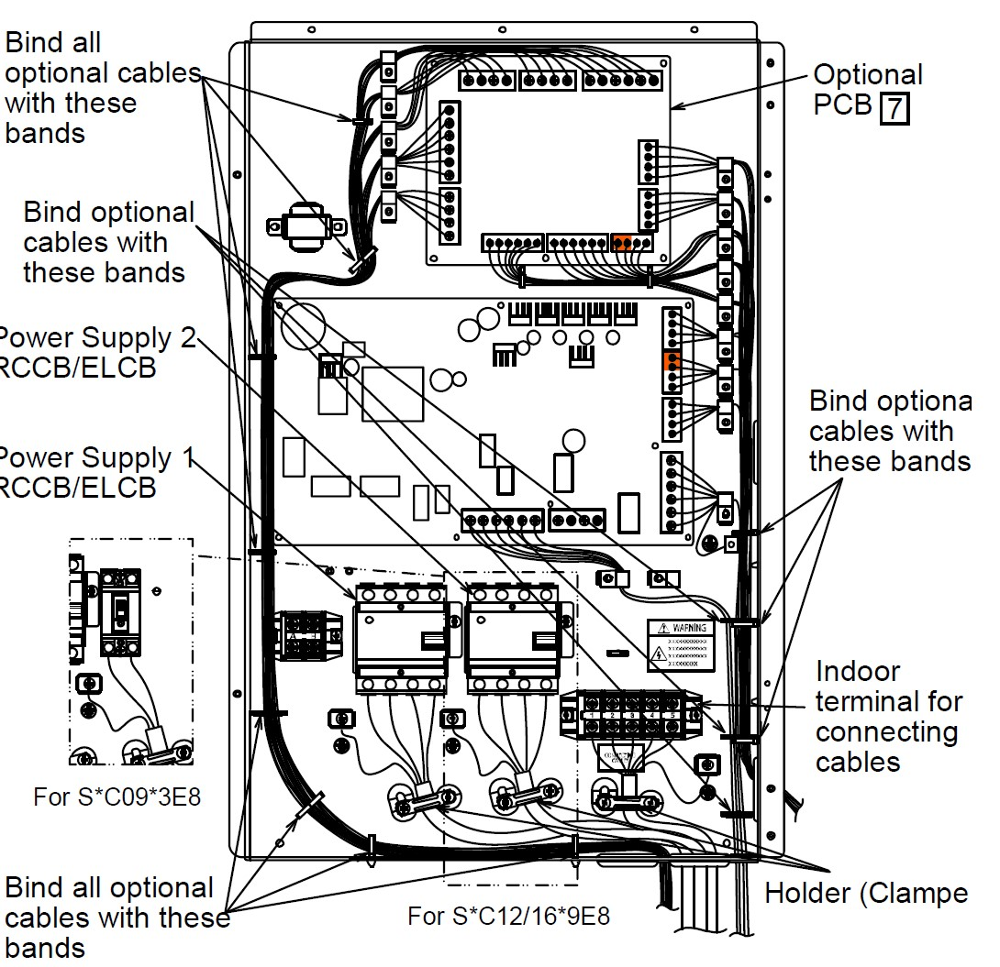

### Temperature
If you already use a external temperature sensor, you should use it as input temperature for the controller.
In case you don't have an external sensor you should connect a fallback resistor to simulate e.g. 10°C.

> [!TIP]
> Alternatively you can also connect the temperature to the outdoor device instead of the indoor device.
> Make sure to check the manual for the correct wiring!

> [!NOTE]
> You need to to change the setting of the T-Cap to use the alternative outdoor sensor, 
> otherwise the temperature of the outdoor unit will be used.

> [!IMPORTANT]
> If there is no temperature sensor available for more than 5s the Device will notice it and log an error.
> Therefore it is required to add an fallback resistor sensor if there is no real sensor connected to the controller.
> This is the reason why the fallback 4CH Relay Module is highly recommended, that will connect the input
> sensor to the T-Cap while the controller is turned off or during boot until it is ready!

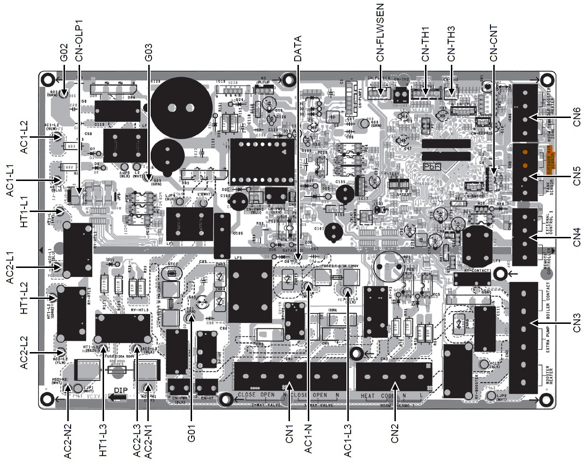

### Demand Control

> [!NOTE]
> The optional PCB needs to be available, needs to be enabled inside the T-Cap settings and the
> demand control needs to be enabled inside system settings.

> [!IMPORTANT]
> Make sure you have connected the 0-10V GND and 10V to the correct connectors, 
> unlike temperature it is important to pay attention to polarity!

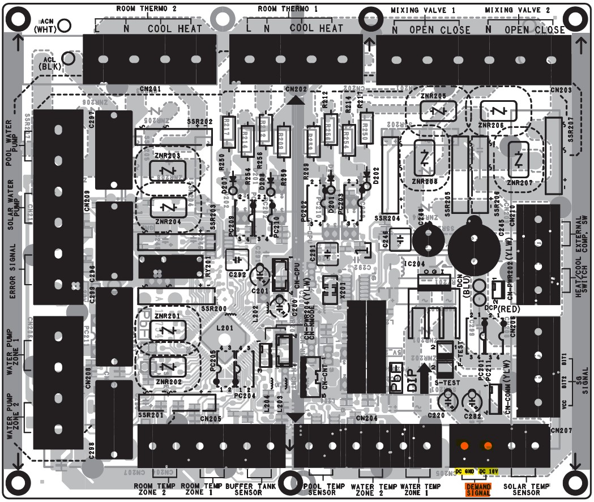

## 3rd Party libraries
The following libraries are used by this project (Thank you very much!)
- [ESPUI](https://github.com/s00500/ESPUI) for webinterface
- [RunningMedian](https://github.com/RobTillaart/RunningMedian) calculation for input temperature sensor
- [arduino-timer](https://github.com/contrem/arduino-timer) for time based functions
- [MycilaESPConnect](https://github.com/mathieucarbou/MycilaESPConnect) inspiration for WiFi AP/Client switching
- [ADC-Accuracy](https://github.com/G6EJD/ESP32-ADC-Accuracy-Improvement-function) ADC accuracy improvement
- [DFRobot_GP8403](https://github.com/DFRobot/DFRobot_GP8403) I2C DAC Module

## License
This project is licensed under [MIT license](LICENSE).